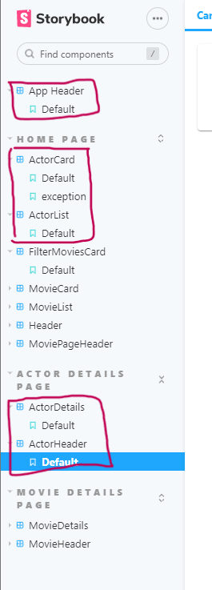
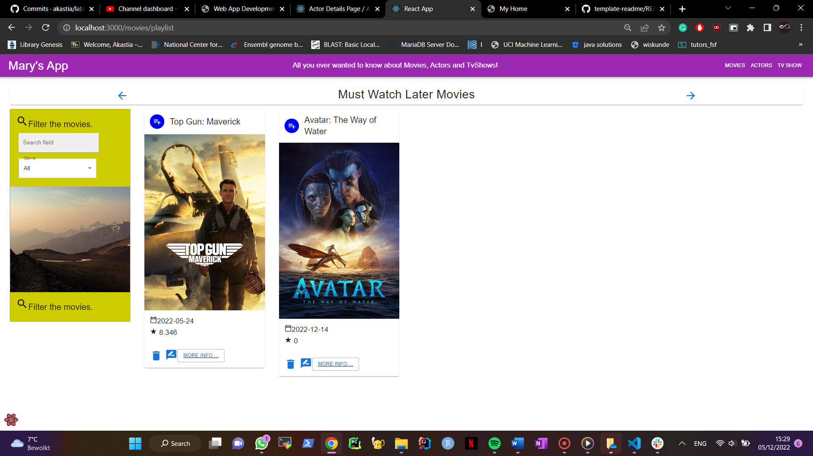
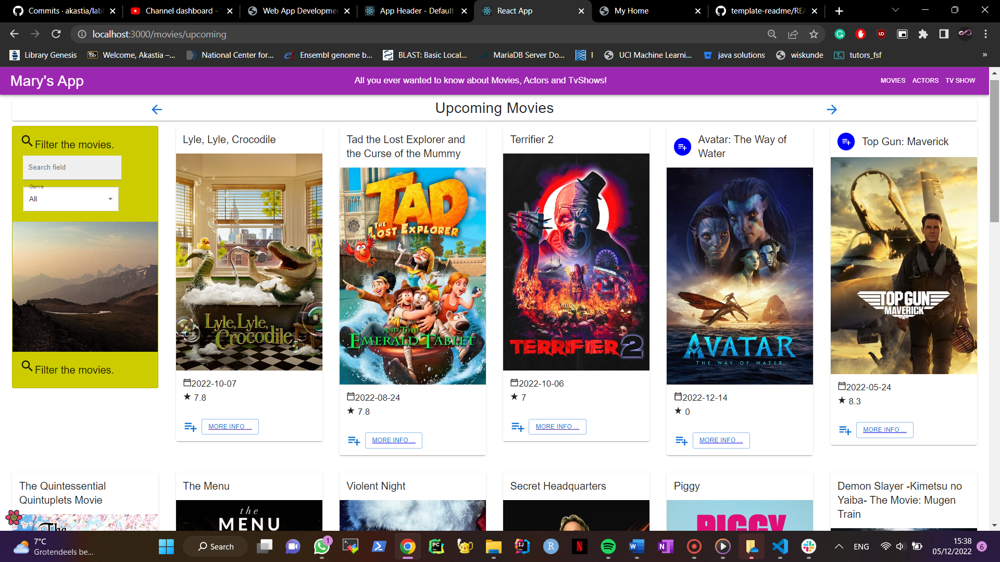
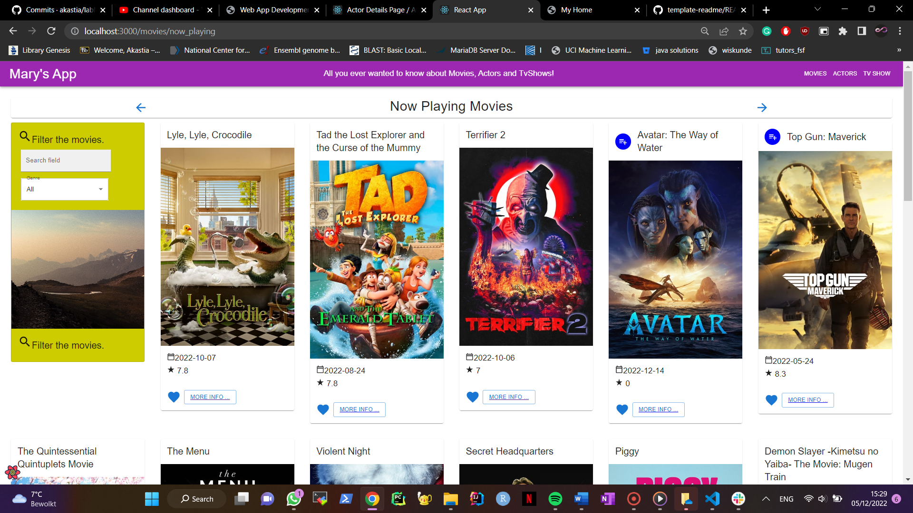
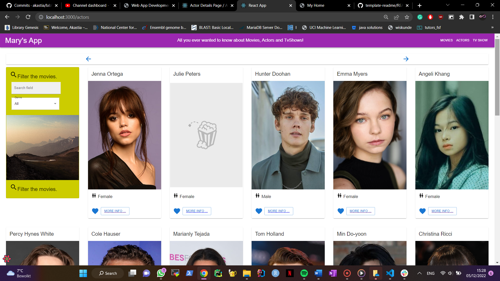
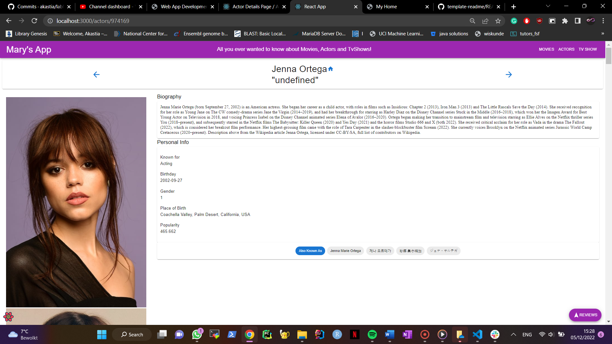
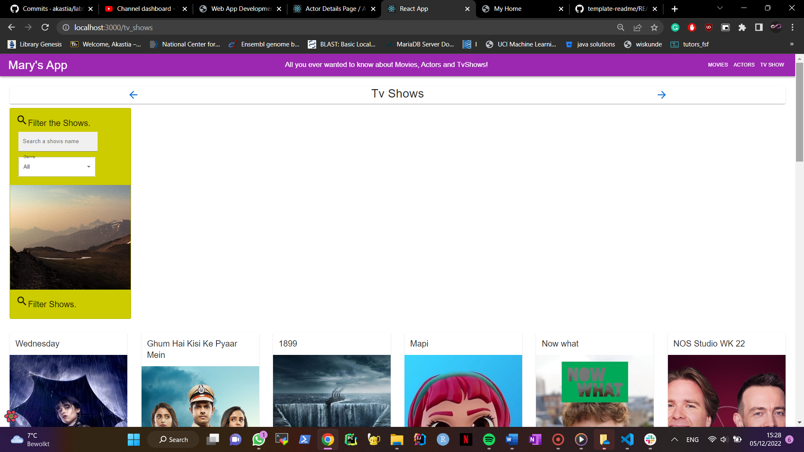
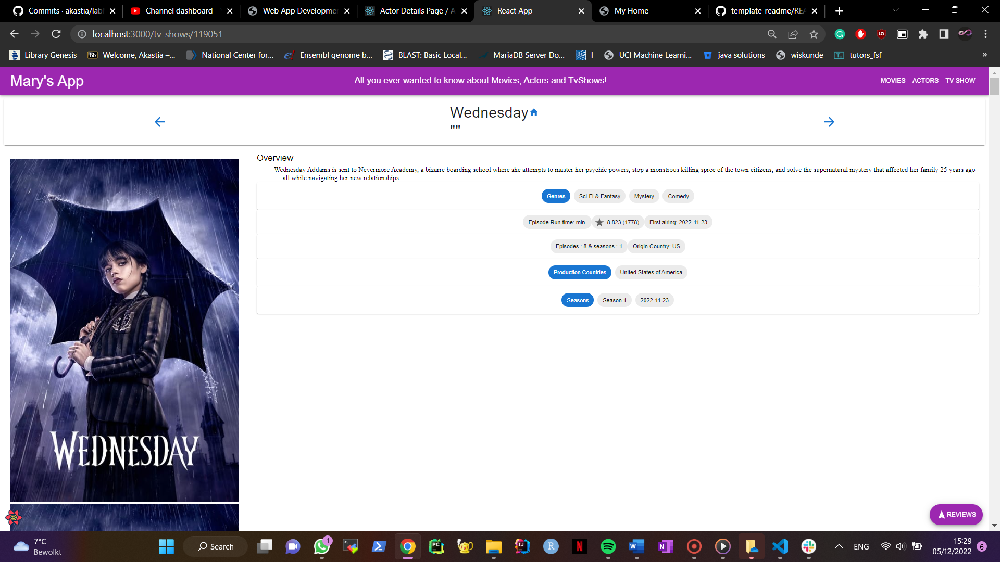
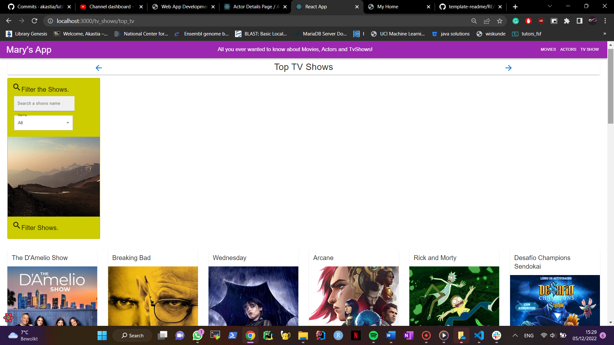
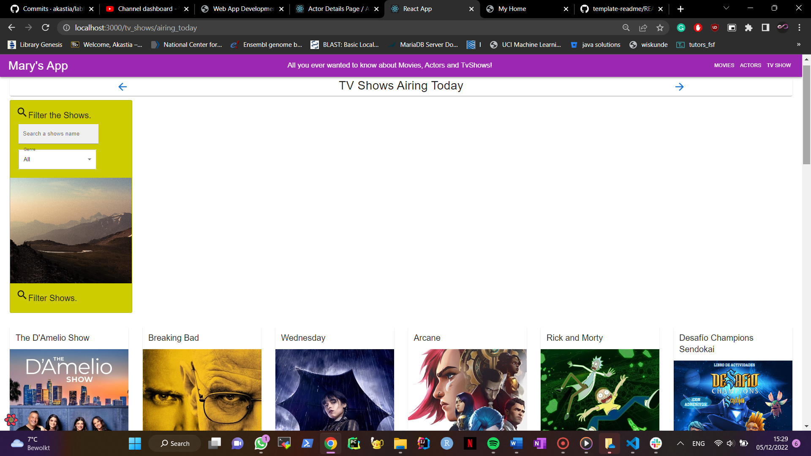

# Web App Dev 2 - Assignment 1 - ReactJS app.

Name: Mary Akastia Christo

## Overview.

### New Pages.

+ List of Upcoming movies - added to get a playlist to add
+ Added a Must Watch page, which where added in the Upcoming movies page. 
+ Top Rated Movies Page
+ Playing Now Movies Page
+ List of Actors.
    + Actors details page
+ List of Tv Shows.
    + Tv shows details
+ Top Rated Tv Shows page
+ Airing Now Tv page

### New Features.

+ added a filter the movies
+ drowdown menu in the site header

## TMDB endpoints.

+ /movie/top_rated - list of top rated movies.
+ /movie/now_playing - list of movies that are playing now.
+ /person/popular - A list of popular actors.
+ /person/{person_id} - A list of details of the actor.
+/person/{person_id}/images - A list of images of the actor.
+ /tv/popular - A list of popular tv shows. 
+ /tv/{tv_id} - details of tv shows.
+ /tv/{tv_id}/images - A list of images of the tv shows.
+ /genre/tv/list - A list of genres for the tv show.
+ /tv/top_rated - list of top rated tv shows
+ /tv/airing_today - list of tv shows that are airing today. 

## App Design.

### Component catalogue.

This shows the storybook

### UI Design.

>Shows the added playlist as must watch as being added in the upcoming page.

>Shows the upcoming movies, added the playlist icon. When clicking on the icon it will show.

>Shows a list of movies that are playing now.

> Shows a list of actors

>Shows detailed information on the actor.

>Shows a list of tv shows.

>Shows detailed information on the tv shows.

> Shows a list of top rated tv shows.

>Shows a list of tv shows that are airing now.

### Routing.

+ /movies/paylist - displays a list of must watch movies that chosen from upcoming
+ /movies/top_movies - displays a list of top rated movies
+ /movies/now_playing - displays a list of movies that are playing now
+ /actors - displays a list of popular actors.
+ /actors/:id - shows details about a particular actor
+ /tv - displays a list of tv shows 
+ /tv/:id - shows details about a particular tv shows
+ /tv/top_tv - displays a list of top rated tv shows
+ /tv/airing_today - displays a list of tv shows that are airing today. 

